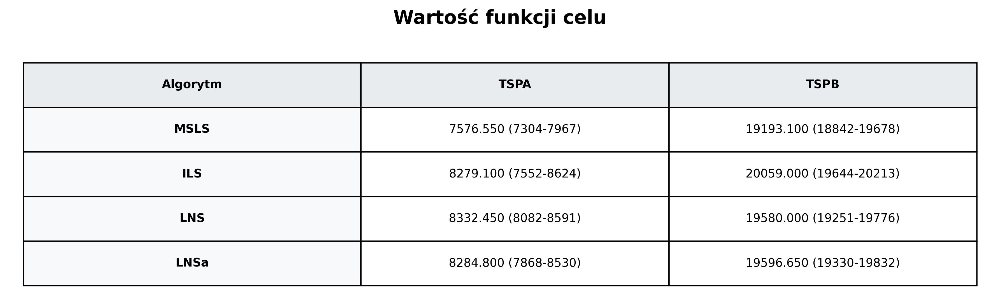
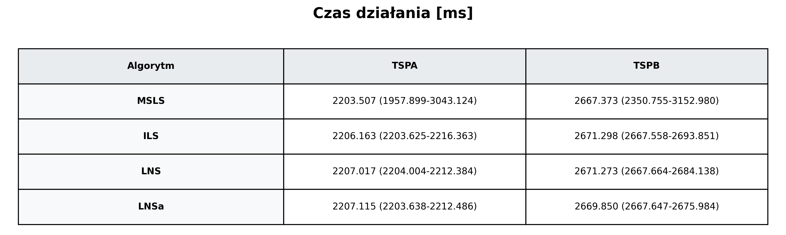
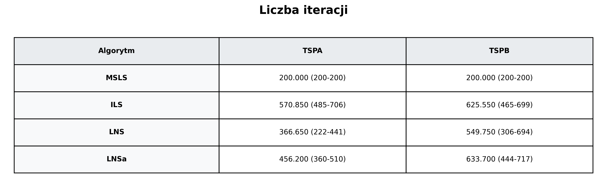
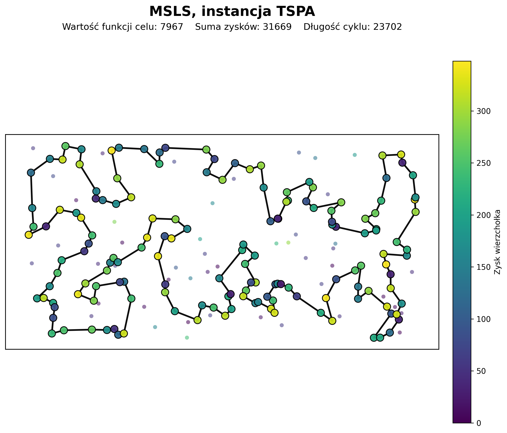
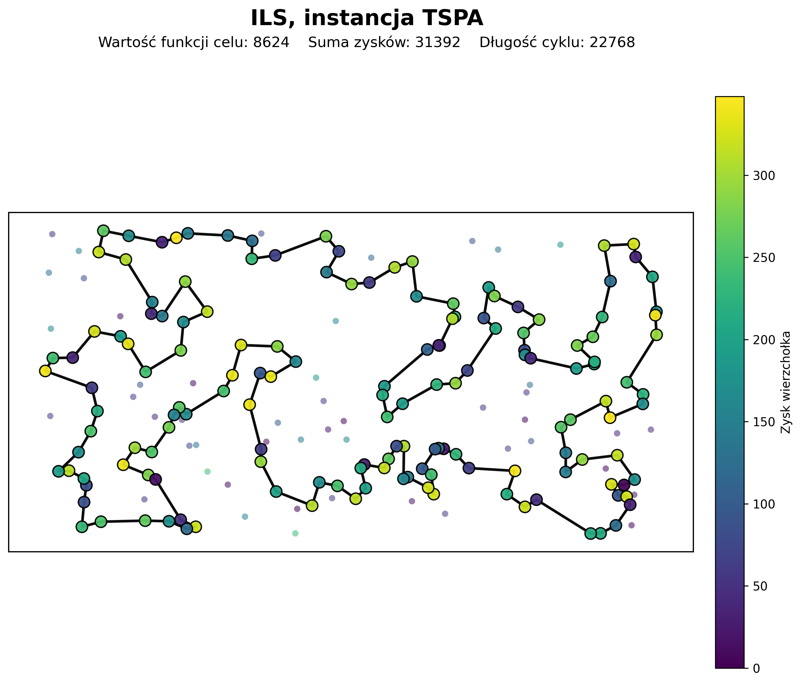
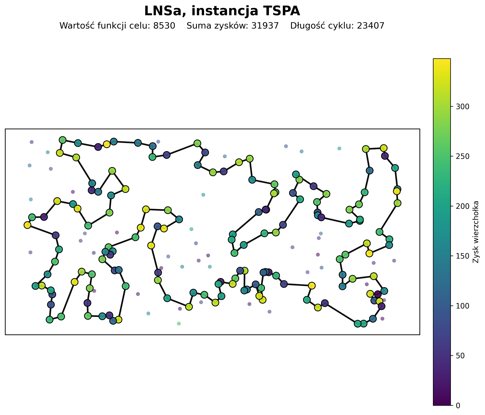
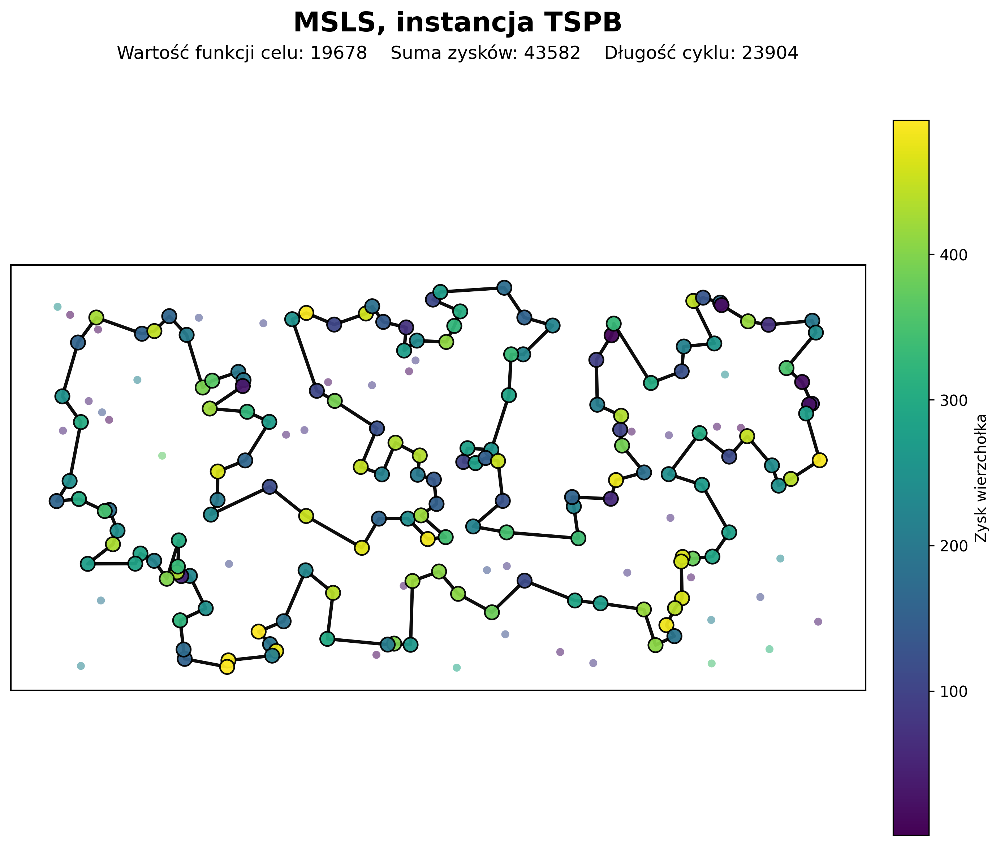
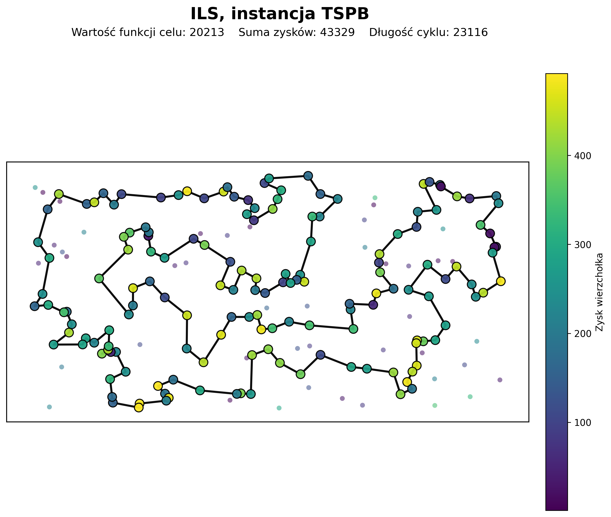
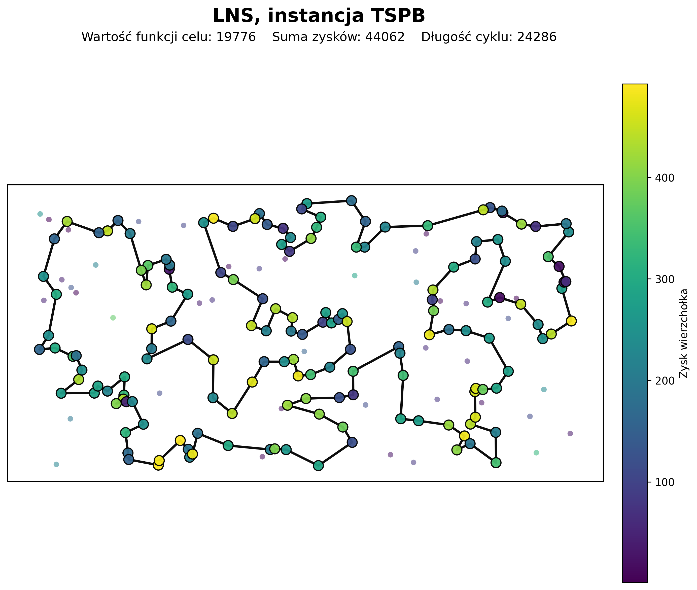
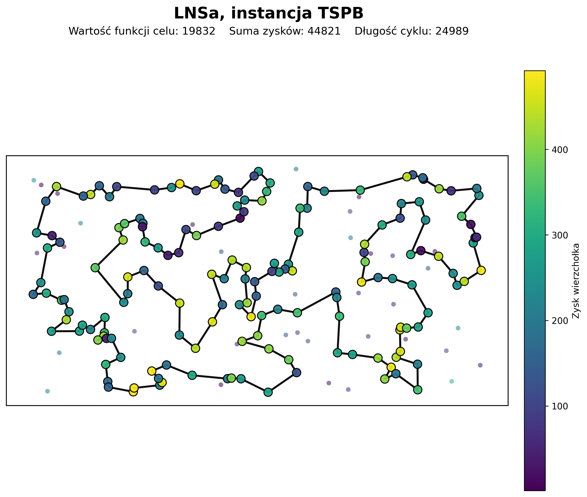

# Zadanie 4. Rozszerzenia lokalnego przeszukiwania


## 1. Opis zadania

W zadaniu porównano rozszerzenia lokalnego przeszukiwania dla zmodyfikowanego problemu komiwojażera z zyskami.
Rozwiązanie jest cyklem przechodzącym przez wybrany podzbiór wierzchołków, a nie przez wszystkie wierzchołki instancji.
Sens takiego wyboru jest prosty: wierzchołek warto odwiedzić tylko wtedy, gdy jego profit pokrywa dodatkowy koszt trasy.

Jakość rozwiązania liczono tak samo jak w poprzednich laboratoriach:

```text
f(C) = suma profitów odwiedzonych wierzchołków - długość zamkniętego cyklu
```

Porównane zostały cztery metody: MSLS, ILS, LNS oraz LNSa.
MSLS był punktem odniesienia, a pozostałe metody miały sprawdzić czy perturbacja albo destroy-repair pozwala wyjść poza jakość uzyskiwaną przez same wielokrotne starty lokalnego przeszukiwania.

## 2. Zastosowane lokalne przeszukiwanie

We wszystkich metodach użyto tego samego lokalnego przeszukiwania: SteepestLocalSearchWithCandidateMoves.
To był najlepszy wariant wybrany po poprzednim laboratorium, więc w tym zadaniu pełni rolę procedury bazowej.

Metoda korzysta z krawędzi kandydackich.
Dla każdego wierzchołka wybieranych jest 10 najbliższych innych wierzchołków i z tych par tworzone są krawędzie kandydackie.
Lokalne przeszukiwanie ocenia tylko ruchy, które wprowadzają co najmniej jedną taką krawędź.

Dzięki temu lokalne przeszukiwanie nie przegląda całego sąsiedztwa, ale nadal szuka ruchów związanych z krótkimi i zwykle sensownymi połączeniami w cyklu.
W lab4 jest to ważne, bo MSLS, ILS i LNS uruchamiają lokalne przeszukiwanie wiele razy.

## 3. Opis zaimplementowanych algorytmów w pseudokodzie

Pseudokody pokazują główną logikę algorytmów, bez przepisywania klas pomocniczych jeden do jednego.
Wszystkie metody korzystają z tej samej funkcji celu f(C), czyli suma profitów minus długość cyklu.

### 3.1 Bazowe lokalne przeszukiwanie

```text
SteepestLocalSearchWithCandidateMoves(instance, cycle, candidateCount = 10)
    przygotuj krawędzie kandydackie dla instancji
    dla każdego wierzchołka v
        znajdź candidateCount najbliższych innych wierzchołków
        oznacz te połączenia jako nieskierowane krawędzie kandydackie

    powtarzaj
        odbuduj indeks pozycji wierzchołków w aktualnym cyklu
        bestMove <- brak
        bestDelta <- 0

        dla każdej krawędzi a-b w cyklu
            rozważ wstawienia nieużytych wierzchołków,
            które są połączone krawędzią kandydacką z a albo z b

        dla każdego wierzchołka v w cyklu
            left <- poprzednik v
            right <- następnik v
            jeżeli krawędź left-right jest kandydacka
                rozważ usunięcie v

        dla każdego wierzchołka a w cyklu
            dla każdego wierzchołka b z listy najbliższych wierzchołków a
                jeżeli b też należy do cyklu
                    rozważ ruchy swap-edges, które mogą wprowadzić krawędź a-b

        wybierz ruch z największą dodatnią deltą funkcji celu
        jeżeli taki ruch istnieje
            wykonaj go na cyklu

    dopóki znaleziono ruch poprawiający

    zwróć cycle
```

Lokalne przeszukiwanie nadal jest strome, bo w każdej iteracji wybierany jest najlepszy znaleziony ruch poprawiający.
Różnica względem pełnego sąsiedztwa polega na tym, że oceniane są tylko ruchy związane z krawędziami kandydackimi.

### 3.2 Multiple Start Local Search

```text
MSLS(instance, startVertexId, runSeed, startsCount = 200)
    randomSolution <- RandomSolution(runSeed)
    bestCycle <- brak
    bestObjective <- -infinity

    dla start od 0 do startsCount - 1
        currentStart <- (startVertexId + start) mod instance.size
        x <- randomSolution.solve(instance, currentStart)
        x <- SteepestLocalSearchWithCandidateMoves(instance, x)
        objective <- f(x)

        jeżeli objective > bestObjective
            bestCycle <- kopia x
            bestObjective <- objective

    zwróć bestCycle
```

Jedno uruchomienie MSLS zawiera 200 uruchomień lokalnego przeszukiwania.
W kodzie ten sam obiekt RandomSolution przechodzi przez kolejne starty, więc seed nie jest resetowany przy każdej próbie.

### 3.3 Iterated Local Search

```text
ILS(instance, startVertexId, runSeed, timeLimit)
    random <- Random(runSeed)
    randomSolution <- RandomSolution(runSeed)

    x <- randomSolution.solve(instance, startVertexId)
    x <- SteepestLocalSearchWithCandidateMoves(instance, x)
    currentObjective <- f(x)
    iterations <- 0
    endTime <- aktualny czas + timeLimit

    dopóki aktualny czas < endTime
        y <- kopia x
        RandomSwapEdgesPerturbation(instance, y, random)
        y <- SteepestLocalSearchWithCandidateMoves(instance, y)
        candidateObjective <- f(y)
        iterations <- iterations + 1

        jeżeli candidateObjective > currentObjective
            x <- y
            currentObjective <- candidateObjective

    zwróć x
```

ILS przyjmuje tylko rozwiązania lepsze od bieżącego.
Ponieważ nie ma akceptacji ruchów pogarszających, perturbacja musi być na tyle duża, żeby czasem przenieść rozwiązanie do innego obszaru przeszukiwania.

### 3.4 Perturbacja ILS

```text
RandomSwapEdgesPerturbation(instance, cycle, random, movesCount = 30)
    powtórz movesCount razy
        jeżeli cykl ma co najmniej 4 wierzchołki
            wylosuj dwie krawędzie, które nie są tą samą krawędzią i nie są sąsiednie
            odwróć fragment cyklu pomiędzy tymi krawędziami
```

Perturbacja jest złożeniem 30 losowych ruchów typu swap-edges.
To zmienia kolejność większego fragmentu cyklu, ale nie buduje całego rozwiązania od nowa.

### 3.5 SegmentDestroyOperator

```text
SegmentDestroyOperator(instance, cycle, random, destroyRatio = 0.40, segmentsCount = 5, candidateListSize = 15)
    verticesToRemove <- round(cycle.size * destroyRatio)
    verticesToRemove <- min(verticesToRemove, cycle.size - 2)

    remainingToRemove <- verticesToRemove
    remainingSegments <- min(segmentsCount, verticesToRemove)

    dopóki remainingSegments > 0
        segmentLength <- ceil(remainingToRemove / remainingSegments)

        dla każdej możliwej pozycji startowej segmentu
            delta <- zmiana funkcji celu po usunięciu tego segmentu
            większa delta oznacza lepszego kandydata do usunięcia

        RCL <- candidateListSize najlepszych pozycji startowych według delty
        startPosition <- losowa pozycja z RCL
        usuń z cyklu segment długości segmentLength od startPosition

        remainingToRemove <- remainingToRemove - segmentLength
        remainingSegments <- remainingSegments - 1
```

Po każdym usunięciu następny segment jest wybierany już w zmienionym cyklu.
Destroy nie usuwa więc czysto losowych wierzchołków, tylko losuje spośród dobrych kandydatów z RCL.

### 3.6 TwoRegretRepairOperator

```text
TwoRegretRepairOperator(instance, partialCycle)
    notUsed <- wszystkie wierzchołki, których nie ma w partialCycle

    dopóki notUsed nie jest puste
        dla każdego wierzchołka v z notUsed
            bestCost <- +infinity
            secondBestCost <- +infinity
            bestPosition <- brak

            dla każdej krawędzi a-b w partialCycle
                cost <- d[a][v] + d[v][b] - d[a][b] - profit[v]
                zaktualizuj najlepszy i drugi najlepszy koszt wstawienia v

            regret <- secondBestCost - bestCost

        wybierz wierzchołek o największym regret
        przy remisie wybierz ten z mniejszym bestCost
        wstaw wybrany wierzchołek w jego najlepsze miejsce
        usuń go z notUsed

    partialCycle <- PhaseTwoDelete(instance, partialCycle)
    zwróć partialCycle
```

Repair wstawia wszystkie brakujące wierzchołki metodą 2-regret.
Dopiero później PhaseTwoDelete usuwa te wierzchołki, które po odbudowie cyklu okazują się nieopłacalne.

### 3.7 PhaseTwoDelete

```text
PhaseTwoDelete(instance, cycle)
    dopóki cycle.size > 2
        bestImprovement <- 0
        bestPosition <- brak

        dla każdego wierzchołka v w cyklu
            left <- poprzednik v
            right <- następnik v
            improvement <- d[left][v] + d[v][right] - d[left][right] - profit[v]

            jeżeli improvement > bestImprovement
                bestImprovement <- improvement
                bestPosition <- pozycja v

        jeżeli bestPosition istnieje
            usuń wierzchołek z bestPosition
        w przeciwnym razie
            zakończ

    zwróć cycle
```

Ten krok jest końcową redukcją po repair.
Usuwany jest tylko taki wierzchołek, którego usunięcie poprawia wartość funkcji celu.

### 3.8 Large Neighborhood Search

```text
LNS(instance, startVertexId, runSeed, timeLimit)
    random <- Random(runSeed)
    randomSolution <- RandomSolution(runSeed)

    x <- randomSolution.solve(instance, startVertexId)
    x <- SteepestLocalSearchWithCandidateMoves(instance, x)
    currentObjective <- f(x)
    iterations <- 0
    endTime <- aktualny czas + timeLimit

    dopóki aktualny czas < endTime
        y <- kopia x
        SegmentDestroyOperator(instance, y, random)
        TwoRegretRepairOperator(instance, y)
        y <- SteepestLocalSearchWithCandidateMoves(instance, y)
        candidateObjective <- f(y)
        iterations <- iterations + 1

        jeżeli candidateObjective > currentObjective
            x <- y
            currentObjective <- candidateObjective

    zwróć x
```

W tej wersji po każdym destroy-repair działa jeszcze lokalne przeszukiwanie.
To jest najcięższa część pojedynczej iteracji LNS.

### 3.9 LNSa

```text
LNSa(instance, startVertexId, runSeed, timeLimit)
    random <- Random(runSeed)
    randomSolution <- RandomSolution(runSeed)

    x <- randomSolution.solve(instance, startVertexId)
    x <- SteepestLocalSearchWithCandidateMoves(instance, x)
    currentObjective <- f(x)
    iterations <- 0
    endTime <- aktualny czas + timeLimit

    dopóki aktualny czas < endTime
        y <- kopia x
        SegmentDestroyOperator(instance, y, random)
        TwoRegretRepairOperator(instance, y)
        candidateObjective <- f(y)
        iterations <- iterations + 1

        jeżeli candidateObjective > currentObjective
            x <- y
            currentObjective <- candidateObjective

    zwróć x
```

LNSa różni się od LNS tylko jednym miejscem: po repair w głównej pętli nie uruchamia lokalnego przeszukiwania.
Początkowe rozwiązanie nadal jest poprawiane lokalnie, tak samo jak w LNS.

## 4. Dobór perturbacji i hiperparametrów

W ILS zastosowano perturbację RandomSwapEdgesPerturbation.
Jedna perturbacja składa się z 30 losowych ruchów typu swap-edges.
Taki ruch wybiera dwie nieprzyległe krawędzie cyklu i odwraca fragment trasy między nimi.
Perturbacja jest więc większa niż pojedynczy ruch lokalny, ale nie buduje rozwiązania od zera.

W LNS oraz LNSa użyto SegmentDestroyOperator.
Operator usuwa około 40% bieżącego cyklu.
Usuwane wierzchołki są podzielone na 5 spójnych segmentów, a początek segmentu losowany jest z listy 15 najlepszych kandydatów.
To daje większą zmianę niż usuwanie pojedynczych losowych wierzchołków, ale nie niszczy całego rozwiązania naraz.

Repair wykonuje TwoRegretRepairOperator.
Najpierw brakujące wierzchołki są wstawiane metodą 2-regret, a na końcu działa PhaseTwoDelete.
Ta końcowa faza usuwa wierzchołki, które po odbudowie cyklu nadal pogarszają wartość funkcji celu.

## 5. Sposób przeprowadzenia eksperymentu

Eksperyment wykonano dla instancji TSPA oraz TSPB.
Każdą metodę uruchomiono 20 razy.
Dla danej instancji przygotowano jeden wspólny zestaw konfiguracji uruchomień, czyli te same wierzchołki startowe i te same seedy losowe dla wszystkich porównywanych metod.
Dzięki temu różnice w wynikach wynikają z działania algorytmów, a nie z innego zestawu startów.

Jedno uruchomienie MSLS zawiera 200 uruchomień lokalnego przeszukiwania z losowych rozwiązań startowych.
Wynikiem takiego uruchomienia jest najlepsze lokalne optimum znalezione w tych 200 próbach.

Dla ILS, LNS i LNSa warunkiem stopu był limit czasu równy średniemu czasowi jednego uruchomienia MSLS na tej samej instancji.
Dla TSPA limit wyniósł około 2203.51 ms, a dla TSPB około 2667.37 ms.
W ten sposób metody perturbacyjne dostały porównywalny budżet czasu względem punktu odniesienia.

Dla każdej metody zapisano średnią, minimalną i maksymalną wartość funkcji celu, czas działania oraz liczbę iteracji.
Dla MSLS liczba iteracji oznacza 200 startów lokalnego przeszukiwania.
Dla ILS oznacza liczbę perturbacji, a dla LNS i LNSa liczbę wykonanych cykli destroy-repair.

## 6. Wyniki eksperymentu obliczeniowego

W komórkach tabel podano średnią oraz zakres od minimum do maksimum.
Czas działania jest podany w milisekundach.







## 7. Wnioski

Wszystkie metody z perturbacją poprawiły MSLS na obu instancjach.
To jest główny wynik eksperymentu, bo MSLS był punktem odniesienia, a ILS, LNS i LNSa miały tylko taki czas, ile średnio zajmował jeden MSLS dla tej samej instancji.

Na TSPA najlepszy średni wynik dał LNS.
Wygląda na to, że usuwanie kilku segmentów i późniejsze lokalne przeszukiwanie dobrze pasowało do tej instancji.
Różnica względem ILS i LNSa nie była ogromna, ale najwyższa średnia była właśnie dla pełnego LNS.

Na TSPB najlepiej wyszedł ILS.
To jest ciekawy wynik, bo ILS używa prostszej zmiany rozwiązania niż LNS.
W tej instancji 30 losowych swap-edges wystarczało, żeby wyjść z lokalnego optimum, a jednocześnie nie psuło dobrej struktury cyklu tak mocno, żeby algorytm zachowywał się jak losowy restart.

LNSa okazał się mocniejszy niż można było się spodziewać po wersji bez lokalnego przeszukiwania po repair.
Na TSPB był nawet trochę lepszy od klasycznego LNS.
To sugeruje, że 2-regret z PhaseTwoDelete sam potrafił odbudować dobre rozwiązanie po destroy, a brak dodatkowego lokalnego przeszukiwania pozwalał wykonać więcej prób w tym samym czasie.

Liczbę iteracji trzeba czytać ostrożnie.
Iteracja MSLS, ILS, LNS i LNSa nie oznacza tej samej pracy.
ILS wykonuje perturbację i lokalne przeszukiwanie, LNS robi destroy, repair i jeszcze lokalne przeszukiwanie, a LNSa pomija ten ostatni krok w głównej pętli.
Dlatego tabela iteracji bardziej pokazuje koszt jednej próby wyjścia z optimum niż prosty ranking algorytmów.

Nie wyszła jedna metoda, która wygrywa na wszystkim.
Na TSPA najlepszy był LNS, na TSPB ILS, a LNSa pokazał że sam destroy-repair też może być bardzo konkurencyjny.
Najbardziej stabilna obserwacja jest taka, że wszystkie trzy rozszerzenia dały lepszą średnią funkcję celu niż MSLS.

## 8. Wizualizacje najlepszych rozwiązań

Poniżej pokazano najlepsze rozwiązania znalezione przez każdą metodę dla obu instancji.
Wizualizacje są dodatkiem do tabel, bo główne porównanie opiera się na statystykach z 20 uruchomień.

### TSPA








### TSPB








